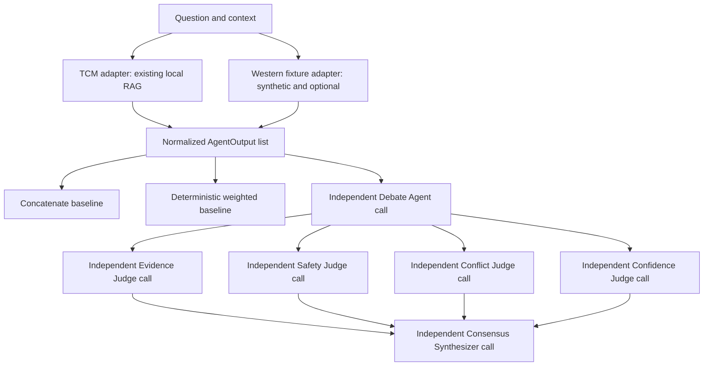

# MediConsensus Orchestration Architecture

The pilot adds a backend orchestration layer without copying or weakening TCM-RAG. `TCMAdapter` invokes the existing `tcm.agent.consult` flow, then normalizes the returned evidence, claims, safety state, abstention, generation source, model metadata, and latency into a shared `AgentOutput` model.

The current Western adapter reads synthetic JSON fixtures. Every such output is `source_type = fixture`, `experimental = true`, carries an explicit fixture limitation, and is disabled unless `ALLOW_WEST_FIXTURE=true`. The placeholder West API adapter never invents an endpoint or fake success.

Domain agents run independently before debate and do not see one another's first-stage outputs. Debate and judges receive the same normalized agent outputs and evidence IDs. Model traces record the role, model, status, latency, and evidence IDs received. API keys are never included.

All roles initially inherit one `LLM_MODEL`, enabling controlled same-model multi-agent experiments. Role-specific model variables later permit heterogeneous experiments without changing orchestration code.
