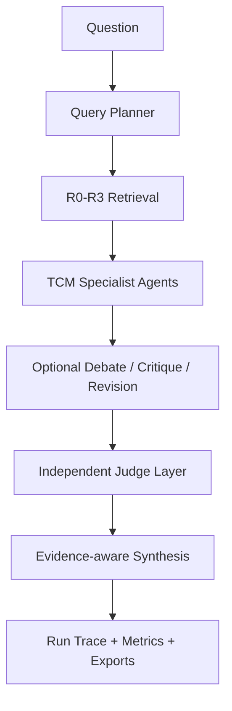
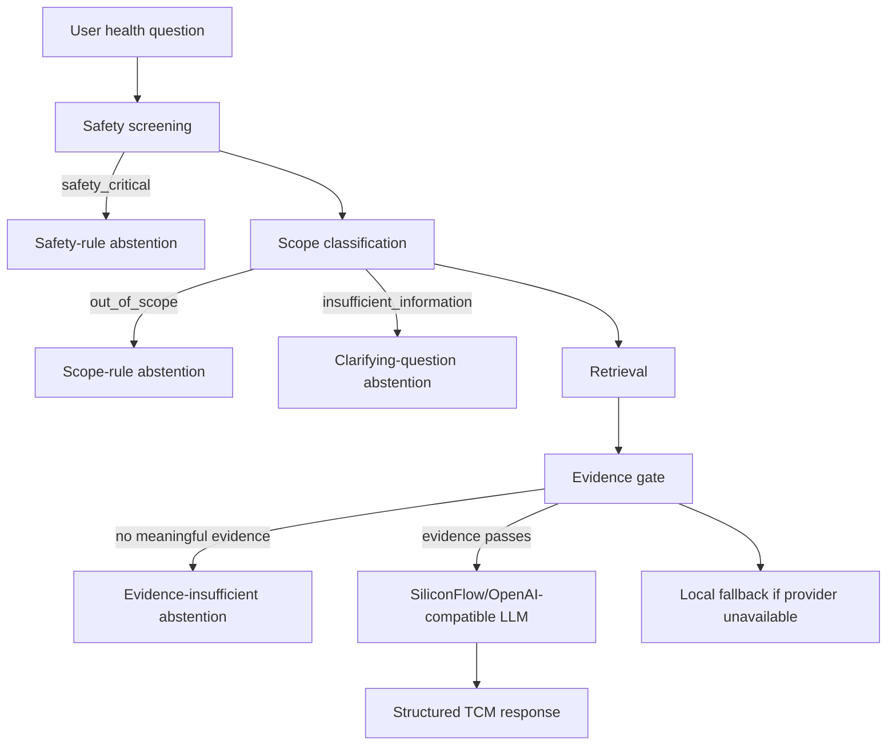

# TCM Research Architecture

The legacy `/api/tcm/consult` endpoint remains the conventional user interface. Research requests use normalized Pydantic models in `backend/schemas/research.py`. Active orchestration lives in `backend/orchestration/`; the old `backend/consensus/` directory is an unimported migration archive.

The planner handles language, TCM intent/subdomain routing, missing context, retrieval filters, scope, and emergency routing. Specialist outputs include claims, evidence IDs, citations, uncertainty, limitations, safety flags, confidence, provenance, provider/model, prompt version, and latency. Hidden chain-of-thought is never stored.

## Archived notes

The TCM-RAG module is a standalone research prototype inside the larger MediRAG-Judge architecture. It does not implement MediRAG-West, multi-agent debate, SafeJudge, or an integrated dual-medicine answer.

Pipeline:

1. Request validation
2. Safety-critical screening
3. Scope classification
4. Evidence retrieval
5. Evidence gate
6. Grounded generation or local fallback
7. Deterministic confidence calculation
8. Structured API response for future Debate/Judge stages

The LLM receives only the user question, optional non-identifying context, retrieved evidence, source metadata, safety constraints, and an output schema. It is not allowed to invent citations, prescriptions, herbs, doses, or treatment claims.
