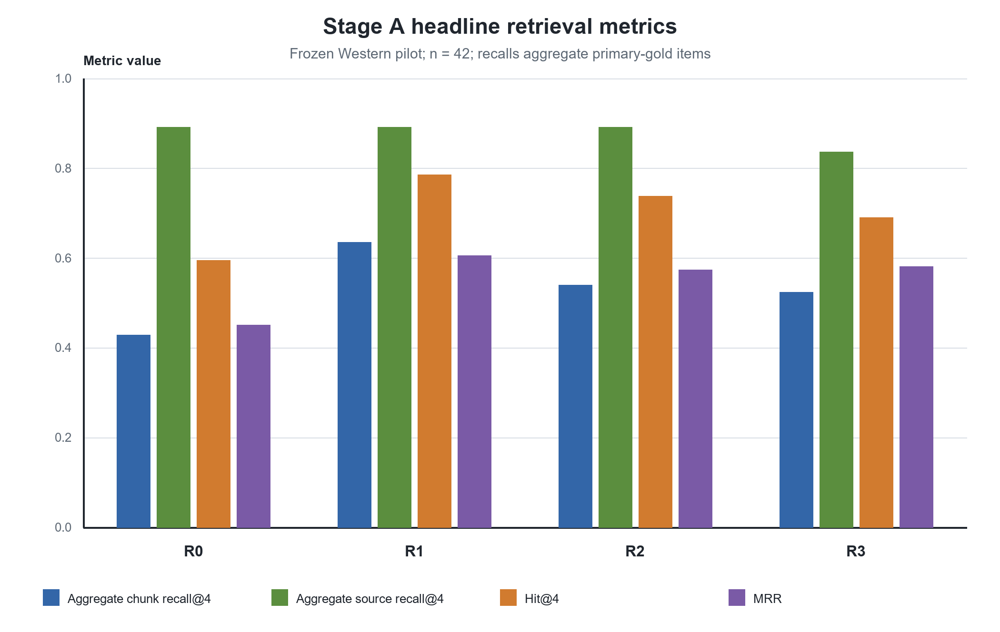
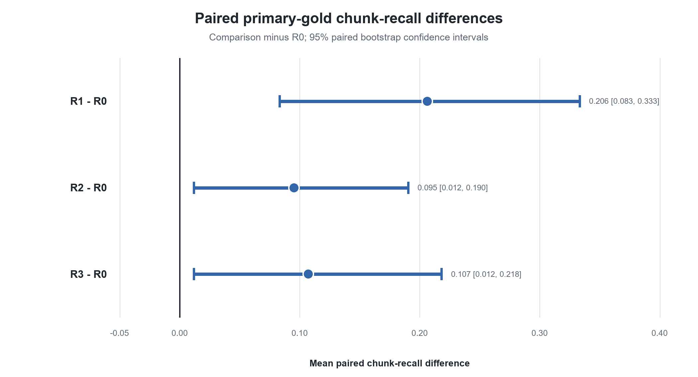

# Stage A Results — W-RQ1

## Analysis population

This analysis addresses only W-RQ1: how retrieval strategies affect gold-evidence retrieval within the frozen MediRAG-West pilot corpus. It uses the frozen run `western-formal-v0.1.2-stage-a-20260918-01` and does not constitute a new experimental run. All 192 retrieval cells completed without a Stage-A technical failure. The benchmark contains 48 cases across four topic domains; the headline retrieval analysis includes the 42 supported or partially supported cases with non-empty primary gold evidence. The evidence base is a 16-review, 271-chunk pilot corpus, so the findings are pilot-specific.

## Headline retrieval metrics

| Condition | Aggregate primary-gold chunk recall@4 | Aggregate primary-source recall@4 | Hit@4 | MRR |
|---|---:|---:|---:|---:|
| R0 | 0.428571 | 0.890909 | 0.595238 | 0.450397 |
| R1 | 0.634921 | 0.890909 | 0.785714 | 0.605159 |
| R2 | 0.539683 | 0.890909 | 0.738095 | 0.573413 |
| R3 | 0.523810 | 0.836364 | 0.690476 | 0.581349 |

R1 measured higher on the headline retrieval metrics in this frozen pilot. This is a descriptive result within the frozen corpus and benchmark; it is not a general retrieval-architecture ranking.

## Paired comparisons against R0

Each comparison uses the successful-pair intersection (`n = 42`) with technical failures excluded rather than imputed as zero. Confidence intervals use the frozen 10,000-resample paired percentile bootstrap with seed `20260815`. McNemar p-values are exact and two-sided.

| Comparison | Paired n | Mean recall difference | Bootstrap 95% CI | Exact two-sided McNemar p |
|---|---:|---:|---:|---:|
| R1 - R0 | 42 | +0.2063492 | [0.0833333, 0.3333333] | 0.038574219 |
| R2 - R0 | 42 | +0.0952381 | [0.0119048, 0.1904762] | 0.03125 |
| R3 - R0 | 42 | +0.1071429 | [0.0119048, 0.2182540] | 0.2890625 |

The effect estimates, confidence intervals, and exact p-values are reported descriptively. No significance stars, binary significance verdicts, rankings, or multiplicity correction have been added.

## Interpretation

Within this frozen pilot, the observed R1-minus-R0 paired mean primary-gold chunk-recall difference was positive, with a 95% bootstrap interval above zero. R2-minus-R0 and R3-minus-R0 also had positive observed paired mean differences and bootstrap intervals above zero. The exact two-sided McNemar p-values describe paired Hit@4 discordance and are presented separately from the recall effect estimates. These observations do not establish that any method is generally preferable outside this pilot.

## Latency limitation

Retrieval latency was confounded by cache state and execution order and is not cleanly interpretable in this frozen pilot. No speed ranking or comparative latency claim is made.

## Reproducibility

The authoritative source is `runs/western-formal-v0.1.2-stage-a-20260918-01/stage_a_retrieval.jsonl`, SHA256 `91749431949c554e8085ef1aae11aede6570c710b1055e1330e5fe452ab2983e`; its byte-identical raw alias is `stage_a_raw_results.jsonl`. Tables and figures are regenerated by `scripts/build-western-stage-a-publication.py`, which calls the existing frozen metric implementations in `backend/western/formal_eval.py` and fails closed on source-hash or result mismatches. `provenance.json` records the complete input and method anchors.
