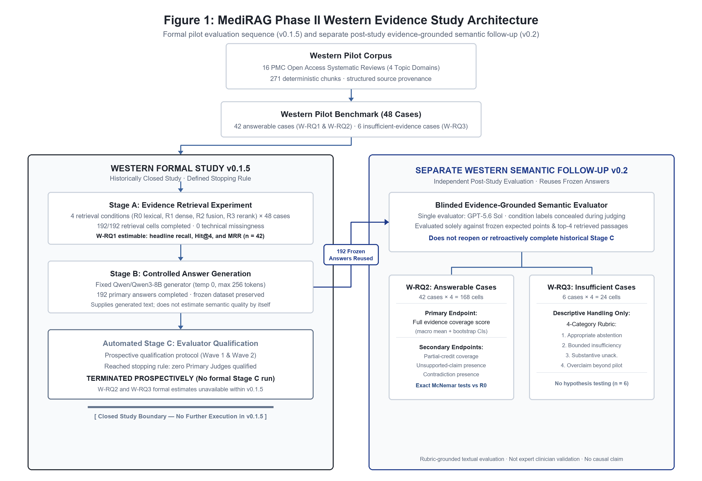
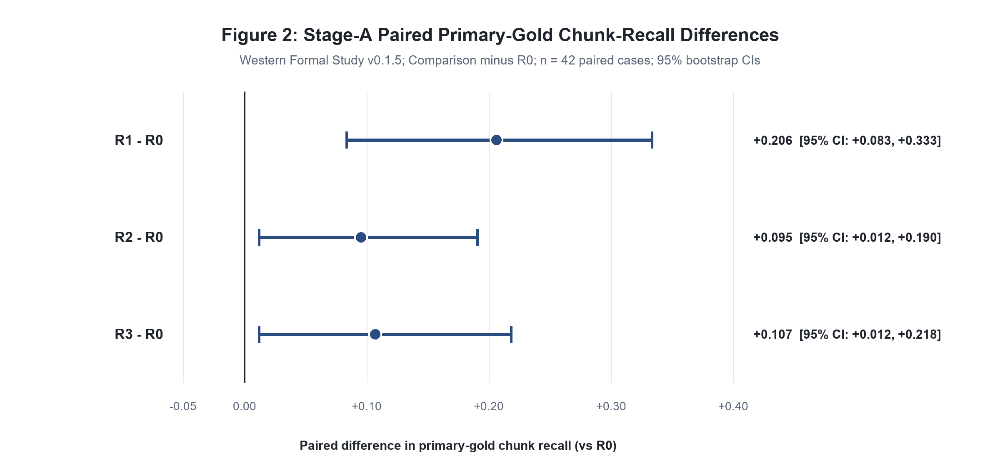
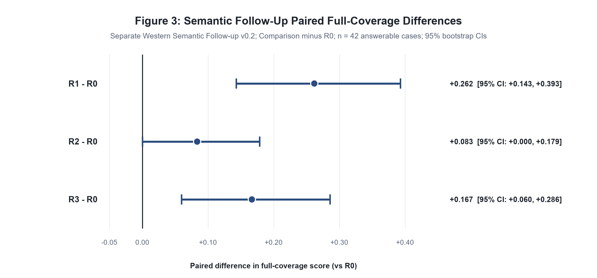

# Corpus-Bounded Western Evidence Retrieval in MediRAG: A Reproducible Pilot and Blinded Semantic Follow-up

> **Advisor-facing manuscript draft v0.2.2.** This presentation version integrates the historically closed Western Formal Study v0.1.5, the separate frozen Western Semantic Follow-up v0.2, and the frozen publication package for Phase II Western Manuscript v0.2.1. It does not represent a new experiment or analysis.

## Abstract

**Background:** Retrieval-augmented generation (RAG) depends on the evidence made available to generation as well as on the generator. In medical information systems, source attribution and provenance support evidence traceability, although citation presence alone does not establish that a source supports a generated claim (Zhao et al., 2026; Samuel et al., 2026; Wu et al., 2025; Carl et al., 2026).

**Objective:** To evaluate how four frozen retrieval conditions affected gold-evidence retrieval in a bounded Western pilot corpus and, in a separate post-study follow-up, how those conditions differed in evidence-grounded semantic behavior for answers produced by a fixed generator.

**Methods:** The pilot corpus comprised 16 PubMed Central Open Access systematic reviews across four symptom domains and 271 deterministic chunks. A 48-case benchmark was evaluated under lexical retrieval (R0), dense retrieval (R1), lexical–dense reciprocal-rank fusion (R2), and fusion followed by reranking (R3), each returning four chunks. Stage-A headline retrieval analyses used 42 supported or partially supported cases. Stage B generated 192 answers with fixed `Qwen/Qwen3-8B`. The original automated Stage C terminated prospectively without a qualified Primary Judge. Western Semantic Follow-up v0.2 later reused the 192 unchanged frozen Stage-B answers and applied one GPT-5.6 Sol evidence-grounded evaluator with retrieval-condition identity concealed. Full evidence-point coverage was the primary semantic endpoint; paired intervals used 10,000 case bootstrap resamples with seed `20260815`.

**Results:** All 192 Stage-A retrieval cells completed. Primary-gold chunk recall@4 was 0.428571, 0.634921, 0.539683, and 0.523810 for R0–R3; Hit@4 was 0.595238, 0.785714, 0.738095, and 0.690476. The frozen primary Stage-B repeat completed 192/192 answers. Within Western Formal Study v0.1.5, W-RQ2 and W-RQ3 remained unavailable because automated Stage C terminated. In the separate follow-up, mean full-coverage scores were 0.543651, 0.805556, 0.626984, and 0.710317. Paired mean differences versus R0 were 0.261905 for R1 (95% bootstrap CI [0.142857, 0.392857]), 0.083333 for R2 ([0.000000, 0.178571]), and 0.166667 for R3 ([0.059524, 0.285714]). Unsupported-claim presence was 9/42, 5/42, 3/42, and 3/42, respectively.

**Conclusions:** The Western pathway functioned reproducibly in this frozen pilot, and retrieval and evidence-grounded semantic outcomes differed descriptively across conditions. The direction of the R1 retrieval and full-coverage observations was aligned, but the study does not establish causation. The corpus, benchmark, fixed generator, and single AI evaluator limit generalization; no clinical correctness or safety conclusion is supported.

## 1. Introduction

RAG systems combine retrieval from an external corpus with language-model generation. Their behavior is shaped by document eligibility, evidence ranking, and the material passed to generation—not only by the generator itself (Zhao et al., 2026; Samuel et al., 2026). In medical information settings, source attribution and provenance support auditability, while citation presence alone does not establish source support for a generated claim (Wu et al., 2025; Carl et al., 2026).

MediRAG Phase II adds a Western-evidence pathway that is architecturally and evidentially separate from the existing traditional Chinese medicine (TCM) pathway. The Western runtime loads a dedicated pilot corpus, routes questions to one of four Western topic domains, retrieves only from that injected corpus, and preserves source and chunk provenance. This separation enables corpus-bounded evaluation; it does not imply that either evidence tradition is comprehensive or that the pathways were compared clinically.

The formal Western pilot evaluated retrieval and controlled evidence-grounded generation. Stage A compared four frozen retrieval conditions, and Stage B generated one answer for every benchmark-condition cell with a fixed generator. Stage C was intended to evaluate evidence coverage, unsupported-claim behavior, and responses to incomplete evidence with a separately qualified automated judge. The qualification process reached its prospectively specified stopping rule without selecting a Primary Judge. Western Formal Study v0.1.5 therefore retained a complete W-RQ1 retrieval result and generation dataset but no formal W-RQ2 or W-RQ3 semantic estimate.

Western Semantic Follow-up v0.2 was created later as a separate post-study evaluation of the already frozen Stage-B answers. It produced evidence-grounded semantic estimates under one GPT-5.6 Sol evaluator without changing the historical Stage-C status. Transparent reporting of unavailable or unevaluable study elements is consistent with broader AI reporting guidance emphasizing missing information, performance errors, and evaluation limitations (Liu et al., 2020; Vasey et al., 2022).

## 2. Research Questions

The frozen protocol defined three Western research questions. The later follow-up preserved their scientific intent while providing a separate route to semantic estimates.

| Research question | Scientific question | Availability |
|---|---|---|
| W-RQ1 | How do retrieval strategies affect gold-evidence retrieval within the frozen MediRAG-West pilot corpus? | Estimable from frozen Stage A. |
| W-RQ2 | With the generator fixed, how do retrieval strategies affect evidence coverage and unsupported-claim behavior in generated Western pilot answers? | Unavailable within v0.1.5; estimated separately in Follow-up v0.2. |
| W-RQ3 | How does the system behave when the frozen pilot corpus provides incomplete or insufficient evidence? | Unavailable within v0.1.5; described separately in Follow-up v0.2. |

Stage-B completion alone does not answer W-RQ2 or W-RQ3. The absence of semantic estimates in v0.1.5 is not a null effect, and the follow-up does not retroactively complete historical Stage C.

## 3. System Architecture

The Western pathway is implemented through `WesternEvidenceAgent`, `WesternRetriever`, and the existing `RetrievalEngine` operating on an injected Western corpus. Topic routing restricts retrieval to cough, dyspepsia/digestive symptoms, headache, or constipation, and runtime checks reject evidence outside the Western corpus or routed topic. Western v1 is a single evidence-agent pathway and does not use the TCM specialist decomposition.

Retrieved evidence carries chunk and source identifiers, rank, article title, section, PMCID, DOI where available, source URL, article-specific license, topic, and other source metadata. Application-generated citation objects preserve these fields separately from generated prose. The generator receives bounded excerpts and source-facing labels, while application-side provenance remains authoritative. Retrieved-item traceability is not equivalent to sentence-level verification of every generated statement.

Figure 1 summarizes the architecture and the critical historical boundary. The separate follow-up branches from the frozen Stage-B outputs; it does not proceed from or reopen terminated Stage C.

**Figure 1. MediRAG Phase II Western Evidence Study Architecture.** The left container represents Western Formal Study v0.1.5: a 16-review, 271-chunk corpus; a 48-case benchmark; completed Stage-A retrieval and Stage-B generation; and automated Stage C, which reached its prospective stopping rule without a qualified Primary Judge or formal semantic estimates. The right container represents the separate Western Semantic Follow-up v0.2, which reused all 192 unchanged frozen Stage-B answers under one blinded GPT-5.6 Sol evidence-grounded evaluator. W-RQ2 included 42 answerable cases (168 cells), and W-RQ3 included six insufficient-evidence cases (24 cells). The follow-up did not reopen or complete automated Stage C in v0.1.5.

## 4. Western Pilot Corpus

The MediRAG-West PMC Open Access Pilot Corpus (`medirag-west-v0.1-pilot`) contains 16 systematic reviews available through PubMed Central Open Access. Four reviews were selected for each pilot topic: cough, dyspepsia/digestive symptoms, headache, and constipation. Deterministic segmentation produced 271 chunks.

The source registry preserves article-level PMCID, DOI, source URL, publication metadata, evidence category, article-specific license fields, retrieval timestamp, and review status. Chunk records retain stable chunk and source identifiers, section, topic, and Western-domain designation. The registry, rather than a package-wide license assumption, is authoritative for reuse conditions.

This deliberately small systematic-review corpus does not represent comprehensive Western medical knowledge, clinical guidelines, primary research, or all evidence relevant to the four topics. Its bounded scope enables deterministic retrieval evaluation but limits generalization.

## 5. Benchmark

The frozen MediRAG-West Pilot Benchmark v0.1 contains 48 cases, 12 per topic. It includes 16 direct-evidence, 12 paraphrased-retrieval, 12 multi-source-synthesis, and eight difficult-or-insufficient cases. Answerability labels comprise 38 supported, four partially supported, and six insufficient cases.

The 42 supported or partially supported cases with non-empty primary gold evidence form the Stage-A headline population and the W-RQ2 follow-up population. The six insufficient cases were excluded from headline primary-gold retrieval denominators rather than imputed as retrieval failures; they form the W-RQ3 population.

Benchmark drafting and secondary review were AI-assisted. The frozen manifest records secondary review by `GPT-5.6 Sol`, a status of `draft_for_manual_review`, and `human_verified=false` and `domain_expert_verified=false`. No clinician, physician, human expert, or independent domain expert adjudicated the benchmark.

## 6. Retrieval Conditions and Experimental Protocol

All retrieval conditions returned four chunks and were executed in a balanced rotating order.

| Condition | Frozen definition |
|---|---|
| R0 | Local deterministic BM25-like lexical retrieval over topic-filtered chunks; top 4. |
| R1 | Dense cosine-similarity retrieval using SiliconFlow `BAAI/bge-m3`; top 4. |
| R2 | Lexical plus dense reciprocal-rank fusion using `1/(60 + lexical_rank) + 1/(60 + dense_rank)`; top 4. |
| R3 | R2 candidate generation at depth 12 followed by `BAAI/bge-reranker-v2-m3` reranking; top 4. |

Formal-strict execution required the stated provider and model identities and prohibited local fallback for provider-dependent conditions. Generation was fixed to SiliconFlow `Qwen/Qwen3-8B`, temperature 0, maximum output 256 tokens, 120-second timeout, one generation per cell, retrieval top-k 4, and the frozen WesternEvidenceAgent prompt contract.

## 7. Stage-A Retrieval Evaluation

Stage-A headline outcomes were aggregate primary-gold chunk recall@4, aggregate primary-source recall@4, Hit@4, and MRR. Aggregate recall is a micro-aggregate across eligible gold items. Hit@4 equals one when at least one primary-gold chunk appears in the top four. MRR uses the reciprocal rank of the first retrieved primary-gold chunk and assigns zero when an eligible case has no retrieved primary-gold chunk.

R1, R2, and R3 were compared with R0 on successful paired case intersections. The effect measure was the mean within-case difference in primary-gold chunk recall. Percentile 95% confidence intervals used 10,000 paired case bootstrap resamples with seed `20260815`. Exact two-sided McNemar p-values used paired Hit@4 discordance. Stage A applied no multiplicity correction. Intervals and p-values are reported descriptively rather than as binary decision labels.

Retrieval latency was recorded but is not used for a clean speed comparison because cache state and execution order were confounded in the frozen run.

## 8. Stage-B Controlled Generation

The original Stage-B attempt associated with `western-formal-v0.1.2-stage-a-20260918-01` produced 192 terminal records: 106 completed and 86 technical failures. The failures formed an uninterrupted suffix beginning at human cell 107, with no later success. Operational metadata supported classification as a provider/infrastructure-outage epoch. The attempt remains preserved for audit, was excluded from the primary dataset, and was not pooled with the repeat; its 106 successful answers were not selected on semantic content.

A prospectively governed full-matrix repeat, `western-formal-v0.1.2-stage-b-r1-20260919-01`, regenerated all 192 cells in frozen order without reusing original answers. It completed 192/192 cells with no technical failures or retries and became the frozen primary Stage-B generation dataset. The generator, prompt, and settings remained unchanged.

Generation completeness is an execution result rather than a semantic assessment. It does not itself estimate correctness, evidence coverage, unsupported-claim behavior, safety, clinical value, or handling of incomplete evidence.

## 9. Historical Automated Stage-C Termination

Stage C in Western Formal Study v0.1.5 was designed to assess W-RQ2 and W-RQ3 using a judge distinct from the generator. The original judge route did not yield a valid formal semantic dataset. Versioned replacement procedures were introduced prospectively while historical incident and qualification artifacts remained immutable. Cross-wave pooling, selective completion or replay, and silent substitution of an unqualified judge were prohibited.

Free-only Wave 1 exhausted its frozen candidate sequence without selecting a Primary Judge. Wave 2 used timestamped provider-catalog, pricing, and capability records for non-semantic discovery and deterministic offline eligibility processing. Its frozen pool contained no eligible or selected candidate. Under the stopping rule, automated Stage C terminated with no Primary Judge and no formal run; Wave 3, automatic paid fallback, and in-study judge-interface redesign were prohibited.

This history documents operational governance under frozen provider, interface, and cost constraints. It is not a comparison of candidate-model quality. W-RQ2 and W-RQ3 semantic estimates remain unavailable within Western Formal Study v0.1.5.

## 10. Separate Western Semantic Follow-up v0.2

Western Semantic Follow-up v0.2 was created after automated Stage C had terminated. It is a separate post-study evaluation, not a resumption or completion of Stage C. It reused the frozen benchmark, Stage-A retrieval outputs, and all 192 unchanged answers from the primary Stage-B repeat.

The 192 answer-condition cells received opaque IDs. Retrieval-condition identity and original experiment IDs were concealed from GPT-5.6 Sol during annotation, and the blind key was withheld until annotation was complete. The evaluator saw the question, answerability designation, frozen expected evidence points, up to four retrieved evidence passages, and generated answer. The rubric directed evaluation only against those materials rather than outside medical knowledge. Because answer and evidence content could indirectly signal retrieval characteristics, this establishes condition-label concealment rather than perfect perceptual blinding.

For answerable cases, expected points were labeled `covered`, `partially_covered`, `not_covered`, or `contradicted`. The primary endpoint was the case-level macro mean `full_coverage_score`; `partial_credit_coverage_score`, unsupported-claim presence and count, contradiction presence, and expected-point labels were secondary. W-RQ2 included 42 cases and 168 cells. Paired mean differences used 10,000 case bootstrap resamples with seed `20260815`. Unsupported-claim presence used exact two-sided McNemar tests with Holm adjustment across three comparisons.

For the six insufficient-evidence cases, W-RQ3 used four frozen labels: `appropriate_abstention`, `appropriate_bounded_insufficiency`, `substantive_answer_without_insufficiency_acknowledgement`, and `overclaim_beyond_pilot_evidence`. Its 24 cells were analyzed descriptively without hypothesis testing or a composite score.

The follow-up used one GPT-5.6 Sol evidence-grounded evaluator. It was not human evaluation, clinician evaluation, expert adjudication, or clinical validation.

## 11. Results

### 11.1 Corpus, benchmark, and completed cells

The evidence base comprised 16 systematic reviews and 271 chunks across four topic groups. The benchmark contained 48 cases: 42 answerable cases used for headline retrieval and W-RQ2, and six insufficient-evidence cases used for W-RQ3. All 192 Stage-A retrieval cells completed without technical failure.

### 11.2 Stage-A retrieval findings

**Table 1: Stage-A Headline Retrieval Metrics**

| Condition | n | Chunk Recall@4 | Source Recall@4 | Hit@4 | MRR |
|---|---|---|---|---|---|
| R0 | 42 | 0.428571 | 0.890909 | 0.595238 | 0.450397 |
| R1 | 42 | 0.634921 | 0.890909 | 0.785714 | 0.605159 |
| R2 | 42 | 0.539683 | 0.890909 | 0.738095 | 0.573413 |
| R3 | 42 | 0.523810 | 0.836364 | 0.690476 | 0.581349 |

**Note:** Frozen Western Formal Study v0.1.5. Headline retrieval denominator is 42 supported or partially supported cases with non-empty primary gold evidence. Six insufficient-evidence cases were excluded from the headline retrieval denominator and not imputed as failures. All conditions evaluated at top-4 retrieval depth. Recalls represent micro-aggregates across primary-gold items.

R1 measured higher on the frozen headline retrieval metrics in this pilot. The paired primary-gold chunk-recall difference was 0.206349 for R1−R0, 0.095238 for R2−R0, and 0.107143 for R3−R0. Figure 2 displays the prespecified bootstrap intervals. Complete discordance counts and exact McNemar p-values are reported in Supplementary Table S1.

**Figure 2. Stage-A paired primary-gold chunk-recall differences versus lexical baseline (R0).** Horizontal forest plot displaying paired differences in primary-gold chunk recall@4 for dense retrieval (R1), reciprocal-rank fusion (R2), and fusion with reranking (R3) relative to the lexical baseline (R0) within Western Formal Study v0.1.5. Contrast direction is comparison condition minus R0. Points indicate case-level mean paired differences across the 42 headline answerable cases with non-empty primary gold evidence; error bars indicate 95% percentile confidence intervals derived from 10,000 paired case bootstrap resamples (seed 20260815). The vertical solid line at zero indicates parity with R0. Point estimates and intervals are descriptive and are not interpreted as binary significance verdicts or general condition superiority outside this bounded pilot.

### 11.3 Stage-B generation and historical Stage C

The original outage attempt remains preserved and excluded from primary analysis. The governed full-matrix repeat generated 192/192 answers with fixed `Qwen/Qwen3-8B`, no technical failures, and no reuse of original answers. Automated Stage C in Western Formal Study v0.1.5 subsequently terminated under its stopping procedure without a qualified Primary Judge or formal semantic run. Thus, Stage A and the primary Stage-B dataset remain valid, while W-RQ2 and W-RQ3 remain unavailable within v0.1.5.

### 11.4 Follow-up population and full evidence coverage

The separate follow-up evaluated all 192 frozen primary Stage-B answers: 168 answerable-case cells for W-RQ2 and 24 insufficient-evidence cells for W-RQ3. No semantic judgment was missing.

**Table 2: Semantic Evidence Full Coverage by Retrieval Condition**

| Condition | n | Mean Full-Coverage Score | SD | Median | Min | Max |
|---|---|---|---|---|---|---|
| R0 | 42 | 0.543651 | 0.453919 | 0.500 | 0.0 | 1.0 |
| R1 | 42 | 0.805556 | 0.335191 | 1.000 | 0.0 | 1.0 |
| R2 | 42 | 0.626984 | 0.430556 | 1.000 | 0.0 | 1.0 |
| R3 | 42 | 0.710317 | 0.387927 | 1.000 | 0.0 | 1.0 |

**Note:** Separate Western Semantic Follow-up v0.2. Evaluates 42 answerable benchmark cases per retrieval condition using fixed Qwen/Qwen3-8B answers. Full-coverage score is the primary semantic endpoint (macro mean of `n_fully_covered / n_expected_points` judged against frozen expected points). Evaluated by a single GPT-5.6 Sol evidence-grounded evaluator with condition identity concealed. Does not represent clinical validation or patient safety.

Under this evidence-grounded evaluation, the paired mean full-coverage differences versus R0 were 0.261905 for R1 (95% bootstrap CI [0.142857, 0.392857]), 0.083333 for R2 ([0.000000, 0.178571]), and 0.166667 for R3 ([0.059524, 0.285714]). Figure 3 shows these comparisons; partial-credit and expected-point details are reported in Supplementary Table S2.

**Figure 3. Follow-up paired full-coverage differences versus lexical baseline (R0).** Horizontal forest plot displaying paired differences in the primary semantic endpoint (case-level macro full evidence-point coverage) for R1, R2, and R3 relative to R0 within the separate Western Semantic Follow-up v0.2. Contrast direction is comparison condition minus R0. Points represent macro mean paired differences across 42 answerable benchmark cases evaluated with the generator held fixed to Qwen/Qwen3-8B; error bars indicate 95% percentile confidence intervals from 10,000 paired case bootstrap resamples (seed 20260815). The vertical line indicates parity with R0. Semantic judgments were produced by a single blinded GPT-5.6 Sol evaluator. Results are pilot-specific descriptive observations and do not establish clinical validity, clinical correctness, or a causal relationship between retrieval performance and generated-answer quality.

### 11.5 Unsupported-claim and contradiction behavior

**Table 3: Unsupported-Claim Presence and Contradiction Behavior**

**Panel A: Condition-Level Rates (n = 42 cases per condition)**

| Condition | Unsupported-Claim Present | Rate | Contradiction Present | Rate | Contradicted Points Total |
|---|---|---|---|---|---|
| R0 | 9/42 | 0.2143 | 5/42 | 0.1190 | 3 |
| R1 | 5/42 | 0.1190 | 1/42 | 0.0238 | 1 |
| R2 | 3/42 | 0.0714 | 2/42 | 0.0476 | 1 |
| R3 | 3/42 | 0.0714 | 1/42 | 0.0238 | 0 |

**Panel B: Paired Comparisons for Unsupported-Claim Presence versus R0**

| Comparison | R0 Present / Comp Absent | R0 Absent / Comp Present | Discordant Pairs | Exact McNemar p | Holm-Adjusted p |
|---|---|---|---|---|---|
| R1 vs R0 | 7 | 3 | 10 | 0.343750 | 0.343750 |
| R2 vs R0 | 6 | 0 | 6 | 0.031250 | 0.093750 |
| R3 vs R0 | 7 | 1 | 8 | 0.070312 | 0.140625 |

**Note:** Secondary outcomes in Western Semantic Follow-up v0.2 across 42 answerable cases. Panel A reports case-level indicator presence (at least one unsupported claim or contradiction in the generated answer). Panel B reports exact two-sided binomial tests on paired discordant presence indicators across the three prespecified R0 comparisons (family size = 3, Holm-Bonferroni adjustment). Unsupported-claim and contradiction annotations are rubric-grounded evaluations against supplied evidence excerpts and do not constitute validated clinical safety or factuality metrics.

Unsupported-claim presence and contradiction presence were numerically lower under R1, R2, and R3 than under R0 in this follow-up. Exact raw and adjusted p-values are retained in Table 3 without a binary verdict. Unsupported-claim counts and paired intervals are available in Supplementary Table S2.

### 11.6 Insufficient-evidence handling

Each condition contributed six W-RQ3 cases. R0 had one `appropriate_abstention` and five `appropriate_bounded_insufficiency` labels. R1, R2, and R3 each had five `appropriate_bounded_insufficiency` labels and one `overclaim_beyond_pilot_evidence` label. No condition contained `substantive_answer_without_insufficiency_acknowledgement`. The complete distribution and cell-level labels appear in Supplementary Table S3.

W-RQ3 was descriptive only. With six cases per condition and no inferential test, these observations neither rank conditions nor establish clinical safety.

## 12. Discussion

The frozen pilot produced measurable retrieval differences across R0–R3. R1 measured higher on the Stage-A headline metrics in this corpus-benchmark configuration. The separate semantic follow-up also observed condition-level differences in evidence coverage, and R1 had the highest observed mean full-coverage score. The direction of the R1 retrieval and semantic-coverage observations was descriptively aligned, but the design does not establish a causal relationship between retrieval performance and generated-answer quality.

Retrieval and downstream semantic behavior are related but not interchangeable (Ru et al., 2024; Samuel et al., 2026). This distinction is visible in the condition patterns and supports direct semantic assessment rather than inference from retrieval metrics alone. The unsupported-claim and contradiction results remain rubric-based judgments against supplied evidence, not validated hallucination measures or clinical factuality assessments.

The W-RQ3 distribution was predominantly `appropriate_bounded_insufficiency`, with isolated `overclaim_beyond_pilot_evidence` labels under R1, R2, and R3. Its small denominator prevents ranking or generalized safety interpretation, but the finding illustrates why incomplete-evidence behavior requires explicit evaluation.

The historical Stage-C stopping process also contributes methodological context. Prospective eligibility criteria, immutable incident records, prohibition of cross-epoch pooling, and a terminal rule explain why v0.1.5 has no formal automated Stage-C dataset. The later follow-up addresses semantic behavior through a separate design rather than rewriting that outcome. These project-specific controls are discussed with broader work on reproducible LLM evaluation and evaluator governance (Pattnayak & Bhatia, 2026; Bavaresco et al., 2025).

Finally, the follow-up is limited by its single-evaluator design. GPT-5.6 Sol applied the frozen rubric without a second judge, human adjudicator, or clinician. No inter-rater reliability or judge-family robustness estimate is available. Retrieval characteristics might also have been indirectly apparent from answer or evidence content despite concealment of condition identity. The resulting semantic estimates are therefore evaluator- and rubric-dependent (Bavaresco et al., 2025; Xu et al., 2025).

## 13. Limitations

1. The evidence base contains 16 systematic reviews and 271 deterministic chunks across four symptom domains.
2. The 48-case benchmark is tailored to this pilot corpus.
3. The generator was fixed to `Qwen/Qwen3-8B`; generator-family variability was not estimated.
4. Follow-up v0.2 used one semantic evaluator, GPT-5.6 Sol.
5. No human, clinician, physician, or independent expert adjudicated the semantic labels.
6. No inter-rater reliability estimate is available.
7. No judge-family robustness analysis was conducted.
8. Condition identity was concealed, but answer and evidence content could indirectly signal retrieval characteristics.
9. Semantic outcomes depend on the frozen rubric and this evaluator’s application of it.
10. Evidence-grounded evaluation does not establish clinical correctness, clinical safety, diagnostic validity, or treatment validity.
11. `unsupported_claim_present` is not a validated general hallucination metric.
12. W-RQ3 includes six cases per condition and is descriptive only.
13. A systematic-review source set is not representative of all clinical evidence, including primary studies and guidelines.
14. The design does not support causal inference between retrieval and generated-answer quality.
15. Retrieval latency was confounded by cache state and execution order, and all findings remain bounded to this frozen pilot.

## 14. Future Work

Future work may expand the Western corpus and medical domains while preserving article- and chunk-level provenance. The benchmark should undergo independent human and clinician adjudication before broader claims are attempted. Retrieval findings could be replicated under larger corpora, alternative retrieval configurations, and prespecified generator-family sensitivity analyses.

Future semantic studies may prequalify automated judges before formal generation, use prospectively defined multi-judge robustness analyses, estimate inter-rater reliability, and include independent human or clinician evaluation where feasible. These are prospective directions rather than results of the present study.

## 15. Conclusion

The Western evidence pathway produced a complete retrieval evaluation for W-RQ1 and a frozen 192-answer Stage-B dataset. Automated semantic Stage C in Western Formal Study v0.1.5 terminated prospectively, leaving W-RQ2 and W-RQ3 unavailable within that historical study version.

The separate Western Semantic Follow-up v0.2 subsequently observed differences in evidence-grounded semantic coverage and unsupported-claim behavior across retrieval conditions. Within this frozen 16-review, 48-case pilot and under a single blinded GPT-5.6 Sol evidence-grounded evaluator, these outcomes differed descriptively across retrieval conditions. The findings do not establish clinical correctness, clinical safety, condition superiority, or a causal relationship between retrieval and generated-answer quality.

## References

- Bavaresco, A., et al. (2025). LLMs instead of Human Judges? A Large Scale Empirical Study across 20 NLP Evaluation Tasks. *Proceedings of the 63rd Annual Meeting of the Association for Computational Linguistics (Volume 2: Short Papers)*, 238–255. https://doi.org/10.18653/v1/2025.acl-short.20 [R9]
- Carl, N., et al. (2026). Enhancing clinicians' trust in large language models via transparent source attribution: A randomized controlled evaluation in uro-oncology. *European Journal of Cancer*, 233, 116168. https://doi.org/10.1016/j.ejca.2025.116168 [R4]
- Liu, X., Cruz Rivera, S., Moher, D., Calvert, M. J., & Denniston, A. K., on behalf of the SPIRIT-AI and CONSORT-AI Working Group. (2020). Reporting guidelines for clinical trial reports for interventions involving artificial intelligence: the CONSORT-AI Extension. *BMJ*, 370, m3164. https://doi.org/10.1136/bmj.m3164 [R5]
- Pattnayak, P., & Bhatia, A. (2026). ReproEvalCard: A Reporting Standard for Reproducible Evaluation of LLM Pipelines. *Proceedings of the 64th Annual Meeting of the Association for Computational Linguistics (Volume 2: Short Papers)*, 238–249. https://doi.org/10.18653/v1/2026.acl-short.22 [R8]
- Ru, D., et al. (2024). RAGChecker: A Fine-grained Framework for Diagnosing Retrieval-Augmented Generation. *Advances in Neural Information Processing Systems 37 (NeurIPS 2024)*. https://doi.org/10.52202/079017-0692 [R7]
- Samuel, S., Martin, A., Yang, E., Yates, A., Lawrie, D., Soboroff, I., Dietz, L., & Van Durme, B. (2026). Beyond Relevance: On the Relationship Between Retrieval and RAG Information Coverage. *Proceedings of the 2026 International ACM SIGIR Conference on Innovative Concepts and Theories in Information Retrieval (ICTIR)*, 337–348. https://doi.org/10.1145/3805713.3820424 [R2]
- Vasey, B., et al. (2022). Reporting guideline for the early-stage clinical evaluation of decision support systems driven by artificial intelligence: DECIDE-AI. *Nature Medicine*, 28, 924–933. https://doi.org/10.1038/s41591-022-01772-9 [R6]
- Wu, K., Wu, E., Wei, K., Zhang, A., Casasola, A., Nguyen, T., Riantawan, S., Shi, P., Ho, D., & Zou, J. (2025). An automated framework for assessing how well LLMs cite relevant medical references. *Nature Communications*, 16, 3615. https://doi.org/10.1038/s41467-025-58551-6 [R3]
- Xu, T. R., Gaur, V., Leqi, L., & Goyal, T. (2025). The Progress Illusion: Revisiting meta-evaluation standards of LLM evaluators. *Findings of the Association for Computational Linguistics: EMNLP 2025*, 19033–19043. https://doi.org/10.18653/v1/2025.findings-emnlp.1036 [R10]
- Zhao, Y., Miao, Y., Guo, R., Luo, Y., Wang, H., & Wu, Y. (2026). Evaluation Methods for Inference-Time Retrieval-Augmented and Graph Retrieval-Augmented Large Language Models in Health Care: Scoping Review. *Journal of Medical Internet Research*, 28, e90046. https://doi.org/10.2196/90046 [R1]
